# 阿渺工具箱 — 系统架构文档

> 版本：v1.2 · 更新日期：2026-06-28
> 维护人：项目 owner
> 相关文档：[部署文档](deployment.md) · [运维 SOP](operations.md) · [故障排查](troubleshooting.md)

**变更记录**：
- v1.2（2026-06-28）— 新增 `ai_invocations` 表 + `observability` 模块（Epic 4）；`audit_logs` 标记为废弃
- v1.1（2026-06-08）— 初版

---

## 目录

1. [系统总览](#1-系统总览)
2. [部署架构](#2-部署架构)
3. [后端模块架构](#3-后端模块架构)
4. [请求处理链](#4-请求处理链)
5. [认证与安全](#5-认证与安全)
6. [OAuth 登录流程](#6-oauth-登录流程)
7. [限流与防重放](#7-限流与防重放)
8. [管理后台](#8-管理后台)
9. [前端架构](#9-前端架构)
10. [数据模型](#10-数据模型)
11. [Redis 键设计](#11-redis-键设计)
12. [配置管理](#12-配置管理)
13. [错误处理](#13-错误处理)

---

## 1. 系统总览

阿渺工具箱是一个自托管的 AI 工具集成门户，采用前后端分离架构。用户通过统一认证登录后，可访问翻译、文生图、文生语音等 AI 工具。所有 AI 调用通过服务端代理转发，保护密钥安全并实现访问控制。

### 技术栈一览

| 层级 | 技术 | 版本 |
|---|---|---|
| 后端框架 | Spring Boot | 4.0.5 |
| 运行时 | Java | 21 |
| 构建 | Maven | - |
| 前端框架 | React + TypeScript | 19 |
| UI 组件库 | Ant Design | 6 |
| 构建工具 | Vite | 6 |
| 数据库 | MySQL | 8.4 |
| 缓存 | Redis | 7 (Alpine) |
| 认证 | JWT (jjwt 0.12.6) + bcrypt + HMAC-SHA256 | - |
| 数据库迁移 | Flyway | - |
| API 文档 | SpringDoc OpenAPI | 2.8.6 |

### 系统架构图

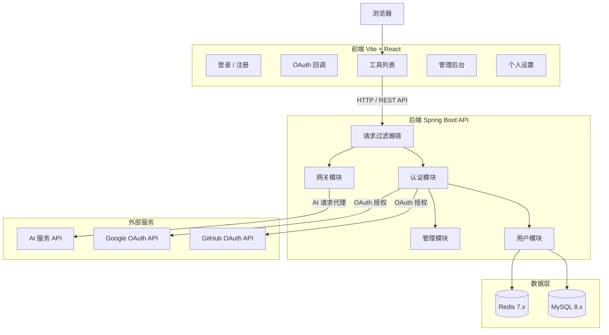
```mermaid
graph TB
    Browser[浏览器]

    subgraph Frontend["前端 Vite + React"]
        LoginPage[登录 / 注册]
        OAuthCB[OAuth 回调]
        ToolsPage[工具列表]
        AdminPage[管理后台]
        SettingsPage[个人设置]
    end

    subgraph Backend["后端 Spring Boot API"]
        direction TB
        Filters[请求过滤器链]
        AuthMod[认证模块]
        UserMod[用户模块]
        AdminMod[管理模块]
        GatewayMod[网关模块]
    end

    subgraph DataLayer["数据层"]
        MySQL[(MySQL 8.x)]
        Redis[(Redis 7.x)]
    end

    subgraph External["外部服务"]
        GitHubAPI[GitHub OAuth API]
        GoogleAPI[Google OAuth API]
        AIAPI[AI 服务 API]
    end

    Browser --> ToolsPage
    ToolsPage -->|"HTTP / REST API"| Filters
    Filters --> AuthMod
    Filters --> GatewayMod
    AuthMod --> UserMod
    AuthMod --> AdminMod
    UserMod --> MySQL
    UserMod --> Redis
    AuthMod -->|"OAuth 授权"| GitHubAPI
    AuthMod -->|"OAuth 授权"| GoogleAPI
    GatewayMod -->|"AI 请求代理"| AIAPI
```

---

## 2. 部署架构

### 开发环境 (miao-infra + 本地进程)

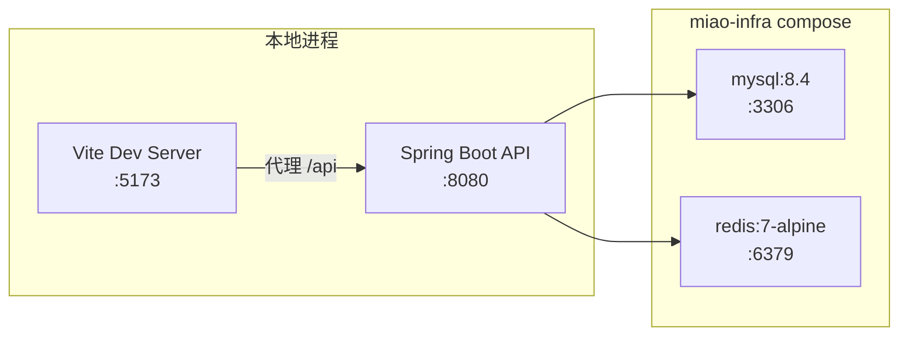
```mermaid
graph LR
    subgraph miao-infra compose
        MySQL_C[mysql:8.4<br/>:3306]
        Redis_C[redis:7-alpine<br/>:6379]
    end

    subgraph 本地进程
        API[Spring Boot API<br/>:8080]
        Web[Vite Dev Server<br/>:5173]
    end

    API --> MySQL_C
    API --> Redis_C
    Web -->|"代理 /api"| API
```

| 服务 | 容器名 | 端口 | 镜像 | 来源 |
|---|---|---|---|---|
| MySQL | miao-mysql | 3306:3306 | mysql:8.4 | miao-infra |
| Redis | miao-redis | 6379:6379 | redis:7-alpine | miao-infra |

> 当前开发环境 API 和前端以本地进程运行,数据库和缓存由 miao-infra 启动。
> 网络 `miao-infra-net` 由 miao-infra 创建并声明为 external,本项目 compose 在需要容器化 dev 时引用。

### 生产环境 (miao-infra + miao-toolbox 编排)

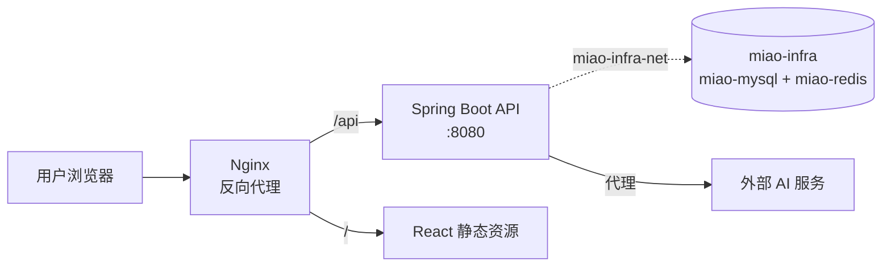
```mermaid
graph LR
    Client[用户浏览器] --> Nginx[Nginx<br/>反向代理]
    Nginx -->|"/api"| API[Spring Boot API<br/>:8080]
    Nginx -->|"/"| Web[React 静态资源]
    API -.->|miao-infra-net| Infra[(miao-infra<br/>miao-mysql + miao-redis)]
    API -->|"代理"| External[外部 AI 服务]
```

---

## 3. 后端模块架构

后端采用分层包结构，按业务领域划分为 6 个核心模块：

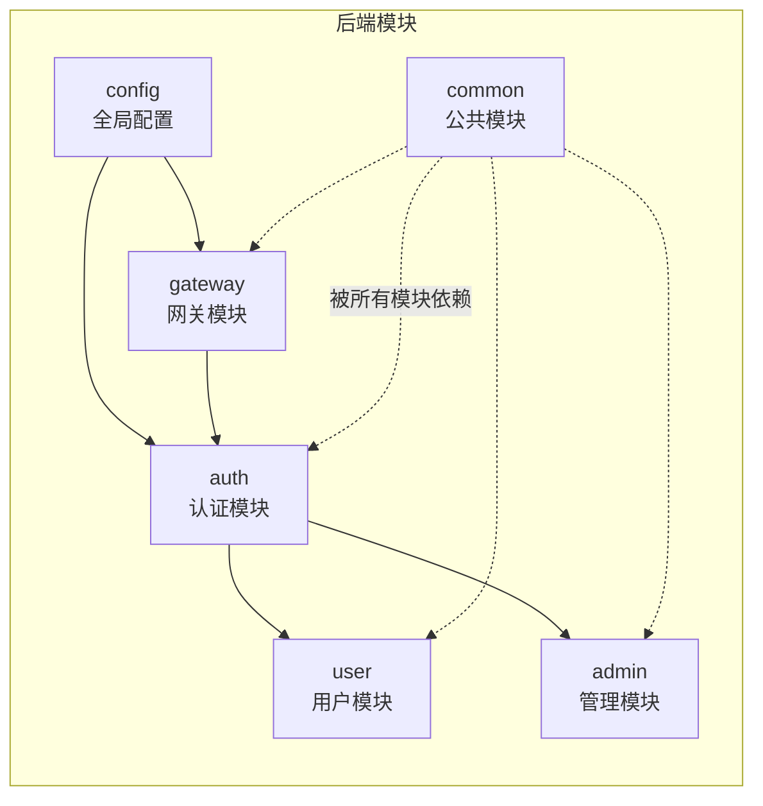
```mermaid
graph TB
    subgraph 后端模块
        direction TB
        Config[config<br/>全局配置]
        Auth[auth<br/>认证模块]
        Gateway[gateway<br/>网关模块]
        User[user<br/>用户模块]
        Admin[admin<br/>管理模块]
        Common[common<br/>公共模块]
    end

    Config --> Auth
    Config --> Gateway
    Auth --> User
    Auth --> Admin
    Gateway --> Auth
    Common -.->|"被所有模块依赖"| Auth
    Common -.-> Gateway
    Common -.-> User
    Common -.-> Admin
```

### 模块职责

| 模块 | 包路径 | 职责 |
|---|---|---|
| **config** | `com.miao.toolbox.config` | Spring Security、Redis、Jackson、RestTemplate 全局配置 |
| **auth** | `com.miao.toolbox.auth` | JWT 认证、OAuth 登录（GitHub/Google）、注册/登录/登出/改密、Refresh Token 管理 |
| **gateway** | `com.miao.toolbox.gateway` | 限流（滑动窗口）、防重放（HMAC 签名 + Nonce） |
| **user** | `com.miao.toolbox.user` | 用户信息查询、OAuth 绑定/解绑、密码修改 |
| **admin** | `com.miao.toolbox.admin` | 仪表盘统计、审计日志查询、用户管理（启禁/角色/限流） |
| **common** | `com.miao.toolbox.common` | 统一响应格式、错误码、全局异常处理、RequestId、Redis 键常量 |

### 模块内部层次

```
模块/
├── controller/     ← REST 端点，仅做参数校验和调用 Service
├── service/        ← 业务逻辑，不依赖 HTTP 对象
├── entity/         ← JPA 实体（对应数据库表）
├── repository/     ← Spring Data JPA 接口
├── dto/            ← 请求/响应数据传输对象
├── filter/         ← Servlet 过滤器（仅 auth 模块）
├── oauth/          ← OAuth 服务（仅 auth 模块）
└── util/           ← 工具类
```

---

## 4. 请求处理链

每个 API 请求从进入后端到返回响应，依次经过 4 层过滤器：

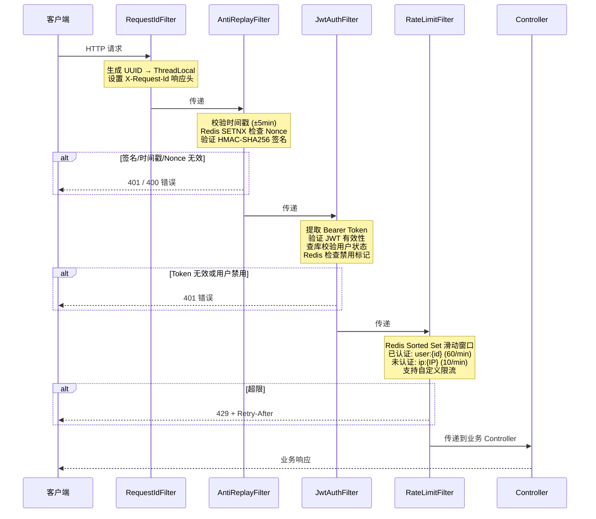
```mermaid
sequenceDiagram
    participant C as 客户端
    participant RIF as RequestIdFilter
    participant ARF as AntiReplayFilter
    participant JAF as JwtAuthFilter
    participant RLF as RateLimitFilter
    participant CTL as Controller

    C->>RIF: HTTP 请求
    Note over RIF: 生成 UUID → ThreadLocal<br/>设置 X-Request-Id 响应头
    RIF->>ARF: 传递
    Note over ARF: 校验时间戳 (±5min)<br/>Redis SETNX 检查 Nonce<br/>验证 HMAC-SHA256 签名
    alt 签名/时间戳/Nonce 无效
        ARF-->>C: 401 / 400 错误
    end
    ARF->>JAF: 传递
    Note over JAF: 提取 Bearer Token<br/>验证 JWT 有效性<br/>查库校验用户状态<br/>Redis 检查禁用标记
    alt Token 无效或用户禁用
        JAF-->>C: 401 错误
    end
    JAF->>RLF: 传递
    Note over RLF: Redis Sorted Set 滑动窗口<br/>已认证: user:{id} (60/min)<br/>未认证: ip:{IP} (10/min)<br/>支持自定义限流
    alt 超限
        RLF-->>C: 429 + Retry-After
    end
    RLF->>CTL: 传递到业务 Controller
    CTL-->>C: 业务响应
```

### 过滤器详细说明

| # | 过滤器 | 类型 | 条件 | 跳过路径 |
|---|---|---|---|---|
| 1 | `RequestIdFilter` | Servlet Filter | 始终注册 | 无 |
| 2 | `AntiReplayFilter` | Spring Security Filter | 有 Redis | `/api/auth/login`, `/api/auth/register`, `/api/auth/refresh`, `/api/auth/oauth/**`, `/actuator`, `/swagger-ui`, `/v3/api-docs` |
| 3 | `JwtAuthFilter` | Spring Security Filter | 始终注册 | 同 SecurityConfig permitAll 路径 |
| 4 | `RateLimitFilter` | Spring Security Filter | 有 Redis | `/actuator`, `/swagger-ui`, `/v3/api-docs` |

---

## 5. 认证与安全 — 双令牌方案

### 5.1 设计动机

核心矛盾是**安全性和用户体验的平衡**：

- 把 Token 设得很长（如 7 天）→ 一旦泄露，攻击者可冒充 7 天
- 把 Token 设得很短（如 15 分钟）→ 用户每 15 分钟就得重新输入密码

双令牌方案通过职责分离解决这个矛盾：**Access Token 是"通行证"，短期有效，到处使用；Refresh Token 是"身份证"，长期有效，只在前台换通行证，且每次换完就换一张新身份证。**

### 5.2 双令牌对比

| | Access Token | Refresh Token |
|---|---|---|
| **用途** | 证明"我是谁"，每个 API 请求都带 | 证明"我之前登录过"，仅用于换新 Access Token |
| **有效期** | 15 分钟 | 7 天 |
| **存储位置** | 前端内存（闭包变量） | httpOnly Cookie（浏览器自动管理） |
| **传输方式** | `Authorization: Bearer xxx` 请求头 | Cookie 随请求自动携带 |
| **能否被 JS 读取** | ✅ 能（需要读取来发请求） | ❌ 不能（httpOnly 阻止 XSS 窃取） |
| **服务端是否存储** | 不存储（JWT 自包含验证） | 存储 SHA-256 哈希到 `refresh_tokens` 表 |
| **签名密钥** | `miao.jwt.secret` | `miao.jwt.refresh-secret`（不同密钥） |

### 5.3 令牌存储架构

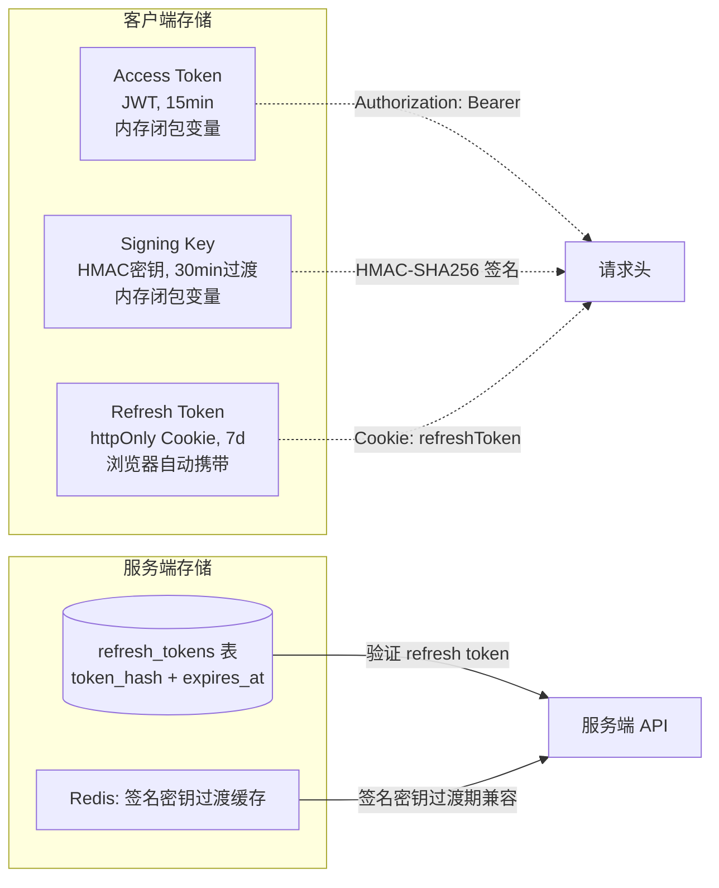
```mermaid
graph LR
    subgraph 客户端存储
        AT["Access Token<br/>JWT, 15min<br/>内存闭包变量"]
        SK["Signing Key<br/>HMAC密钥, 30min过渡<br/>内存闭包变量"]
        RT["Refresh Token<br/>httpOnly Cookie, 7d<br/>浏览器自动携带"]
    end

    subgraph 服务端存储
        DB_RT[(refresh_tokens 表<br/>token_hash + expires_at)]
        Redis_SK[Redis: 签名密钥过渡缓存]
    end

    请求头["请求头"]
    服务端["服务端 API"]

    AT -.->|"Authorization: Bearer"| 请求头
    SK -.->|"HMAC-SHA256 签名"| 请求头
    RT -.->|"Cookie: refreshToken"| 请求头
    DB_RT -->|"验证 refresh token"| 服务端
    Redis_SK -->|"签名密钥过渡期兼容"| 服务端
```

> **为什么不存 localStorage？** localStorage 可被 XSS 读取，一旦有 XSS 漏洞，Token 全部泄露。闭包变量只在 JS 进程内存中，XSS 无法直接获取历史值。

### 5.4 登录流程

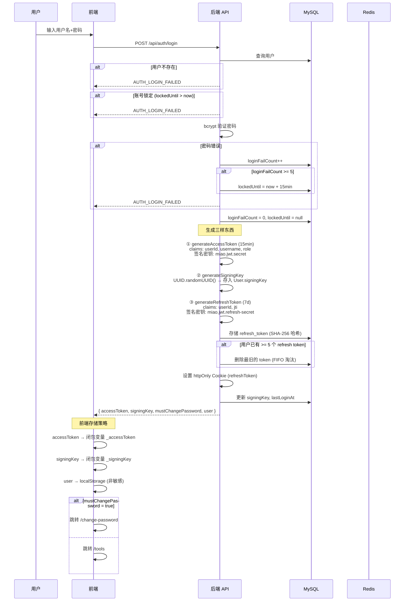
```mermaid
sequenceDiagram
    participant U as 用户
    participant FE as 前端
    participant API as 后端 API
    participant DB as MySQL
    participant Redis as Redis

    U->>FE: 输入用户名+密码
    FE->>API: POST /api/auth/login
    API->>DB: 查询用户
    alt 用户不存在
        API-->>FE: AUTH_LOGIN_FAILED
    end
    alt 账号锁定 (lockedUntil > now)
        API-->>FE: AUTH_LOGIN_FAILED
    end
    API->>API: bcrypt 验证密码
    alt 密码错误
        API->>DB: loginFailCount++
        alt loginFailCount >= 5
            API->>DB: lockedUntil = now + 15min
        end
        API-->>FE: AUTH_LOGIN_FAILED
    end
    API->>DB: loginFailCount = 0, lockedUntil = null

    Note over API: 生成三样东西
    API->>API: ① generateAccessToken (15min)<br/>   claims: userId, username, role<br/>   签名密钥: miao.jwt.secret
    API->>API: ② generateSigningKey<br/>   UUID.randomUUID() → 存入 User.signingKey
    API->>API: ③ generateRefreshToken (7d)<br/>   claims: userId, jti<br/>   签名密钥: miao.jwt.refresh-secret

    API->>DB: 存储 refresh_token (SHA-256 哈希)
    alt 用户已有 >= 5 个 refresh token
        API->>DB: 删除最旧的 token (FIFO 淘汰)
    end
    API->>API: 设置 httpOnly Cookie (refreshToken)
    API->>DB: 更新 signingKey, lastLoginAt
    API-->>FE: { accessToken, signingKey, mustChangePassword, user }

    Note over FE: 前端存储策略
    FE->>FE: accessToken → 闭包变量 _accessToken
    FE->>FE: signingKey → 闭包变量 _signingKey
    FE->>FE: user → localStorage (非敏感)

    alt mustChangePassword = true
        FE->>FE: 跳转 /change-password
    else
        FE->>FE: 跳转 /tools
    end
```

**关键设计**：Access Token 和 Refresh Token 使用**不同的密钥签名**。即使 Access Token 的密钥泄露，攻击者也无法伪造 Refresh Token。

### 5.5 Token 刷新流程（静默续期）

Access Token 15 分钟过期后，前端通过 Refresh Token 无感续期：

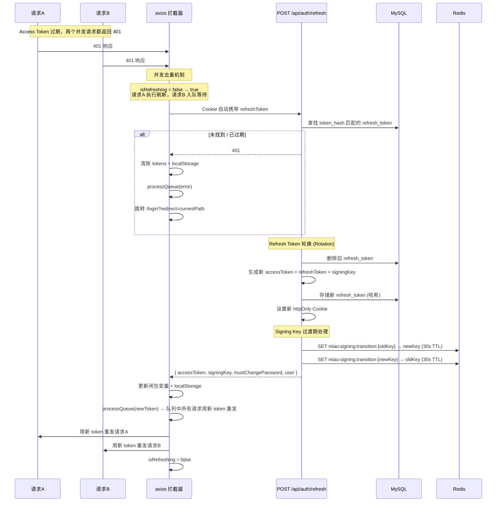
```mermaid
sequenceDiagram
    participant A as 请求A
    participant B as 请求B
    participant FE as axios 拦截器
    participant API as POST /api/auth/refresh
    participant DB as MySQL
    participant Redis as Redis

    Note over A,B: Access Token 过期，两个并发请求都返回 401

    A->>FE: 401 响应
    B->>FE: 401 响应

    Note over FE: 并发去重机制
    Note over FE: isRefreshing = false → true<br/>请求A 执行刷新，请求B 入队等待

    FE->>API: Cookie 自动携带 refreshToken
    API->>DB: 查找 token_hash 匹配的 refresh_token

    alt 未找到 / 已过期
        API-->>FE: 401
        FE->>FE: 清除 tokens + localStorage
        FE->>FE: processQueue(error)
        FE->>FE: 跳转 /login?redirect=currentPath
    end

    Note over API: Refresh Token 轮换 (Rotation)
    API->>DB: 删除旧 refresh_token
    API->>API: 生成新 accessToken + refreshToken + signingKey
    API->>DB: 存储新 refresh_token (哈希)
    API->>API: 设置新 httpOnly Cookie

    Note over API: Signing Key 过渡期处理
    API->>Redis: SET miao:signing:transition:{oldKey} → newKey (30s TTL)
    API->>Redis: SET miao:signing:transition:{newKey} → oldKey (30s TTL)

    API-->>FE: { accessToken, signingKey, mustChangePassword, user }

    FE->>FE: 更新闭包变量 + localStorage
    FE->>FE: processQueue(newToken) → 队列中所有请求用新 token 重发
    FE->>A: 用新 token 重发请求A
    FE->>B: 用新 token 重发请求B
    FE->>FE: isRefreshing = false
```

**并发去重**是关键机制：多个请求同时 401 时，只发一次刷新请求，其余排队等待结果。避免多个并发刷新导致 Refresh Token 被轮换多次，前面的刷新结果失效。

### 5.6 Refresh Token 轮换（Rotation）

每次刷新不是"复用"旧 Refresh Token，而是**销毁旧的、生成新的**：

```
旧 refreshToken → 验证通过 → 删除旧 token 记录 → 生成新 refreshToken → 存储新 token 记录 → 设置新 Cookie
```

**为什么必须轮换？**

假设不轮换：攻击者窃取了 Refresh Token，可以在 7 天内无限次换新 Access Token。即使用户改了密码，旧 Refresh Token 仍然有效。

轮换后：攻击者用窃取的 Refresh Token 刷新一次 → 用户自己的 Refresh Token 失效（旧 token 已被删除）→ 用户下次请求 401 → 刷新失败 → 被迫重新登录 → 间接发现异常。

### 5.7 会话数量限制

每个用户最多 5 个有效 Refresh Token（即 5 个设备同时在线）：

```java
MAX_CONCURRENT_SESSIONS = 5

storeRefreshToken(userId, rawToken):
    existingTokens = findByUserIdOrderByCreatedAtAsc(userId)  // 按创建时间升序
    while (existingTokens.size() >= 5) {
        delete(existingTokens.removeFirst())  // 删除最旧的 → FIFO 淘汰
    }
    save(new RefreshToken(hash(rawToken), userId, expiresAt))
```

第 6 个设备登录时，最老的那个设备会被踢下线（其 Refresh Token 被删除，下次刷新失败）。

### 5.8 Signing Key 过渡期

**问题场景**：用户登录 → 拿到 signingKey A → 15 分钟后 Token 刷新 → 服务端生成新的 signingKey B → 但用户浏览器里可能还有正在飞行的请求用的是 A 签名的 → AntiReplayFilter 用 B 验证 → 签名不匹配 → 请求被拒。

**解法**：30 秒过渡期，新旧密钥同时有效：

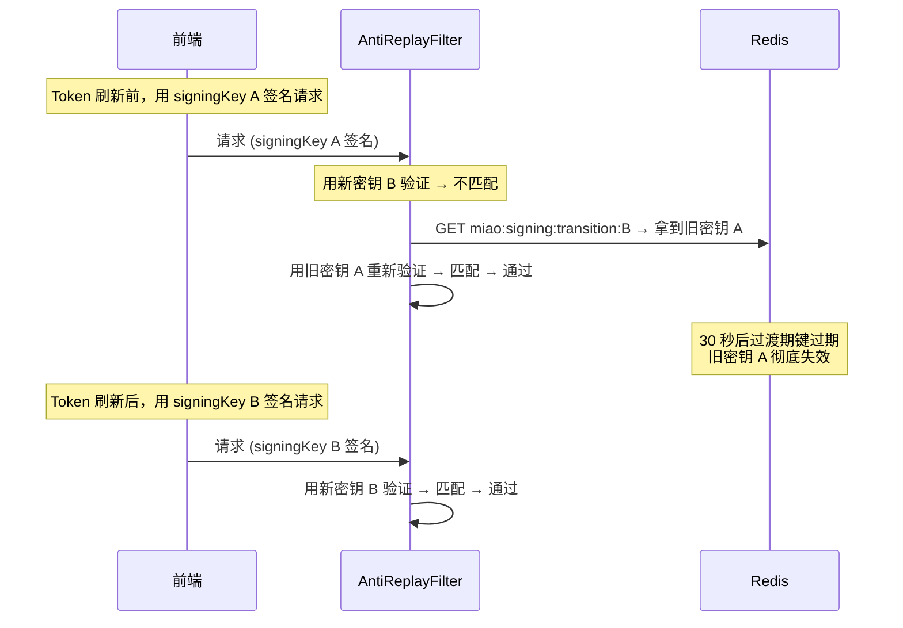
```mermaid
sequenceDiagram
    participant FE as 前端
    participant ARF as AntiReplayFilter
    participant Redis as Redis

    Note over FE: Token 刷新前，用 signingKey A 签名请求
    FE->>ARF: 请求 (signingKey A 签名)

    Note over ARF: 用新密钥 B 验证 → 不匹配
    ARF->>Redis: GET miao:signing:transition:B → 拿到旧密钥 A
    ARF->>ARF: 用旧密钥 A 重新验证 → 匹配 → 通过

    Note over Redis: 30 秒后过渡期键过期<br/>旧密钥 A 彻底失效

    Note over FE: Token 刷新后，用 signingKey B 签名请求
    FE->>ARF: 请求 (signingKey B 签名)
    ARF->>ARF: 用新密钥 B 验证 → 匹配 → 通过
```

过渡期 Redis 键设计：

| 键 | 值 | TTL | 方向 |
|---|---|---|---|
| `miao:signing:transition:{oldKey}` | `newKey` | 30s | 正向：旧→新（查找替换者） |
| `miao:signing:transition:{newKey}` | `oldKey` | 30s | 反向：新→旧（AntiReplayFilter 用） |

30 秒窗口足够让飞行中的请求完成，又不会让旧密钥长期有效。

### 5.9 HMAC-SHA256 请求签名

每个需要认证的 API 请求都携带 HMAC 签名，防止请求被篡改和重放：

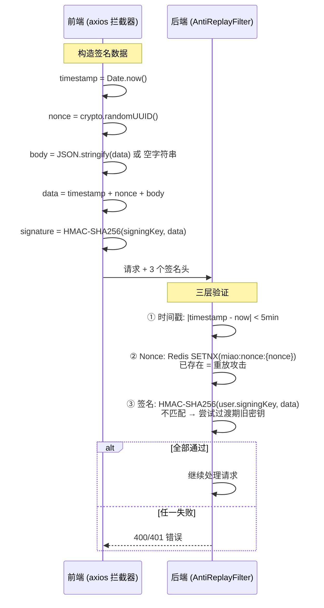
```mermaid
sequenceDiagram
    participant FE as 前端 (axios 拦截器)
    participant API as 后端 (AntiReplayFilter)

    Note over FE: 构造签名数据
    FE->>FE: timestamp = Date.now()
    FE->>FE: nonce = crypto.randomUUID()
    FE->>FE: body = JSON.stringify(data) 或 空字符串
    FE->>FE: data = timestamp + nonce + body
    FE->>FE: signature = HMAC-SHA256(signingKey, data)
    FE->>API: 请求 + 3 个签名头

    Note over API: 三层验证
    API->>API: ① 时间戳: |timestamp - now| < 5min
    API->>API: ② Nonce: Redis SETNX(miao:nonce:{nonce})<br/>   已存在 = 重放攻击
    API->>API: ③ 签名: HMAC-SHA256(user.signingKey, data)<br/>   不匹配 → 尝试过渡期旧密钥

    alt 全部通过
        API->>API: 继续处理请求
    else 任一失败
        API-->>FE: 400/401 错误
    end
```

### 5.10 登出流程

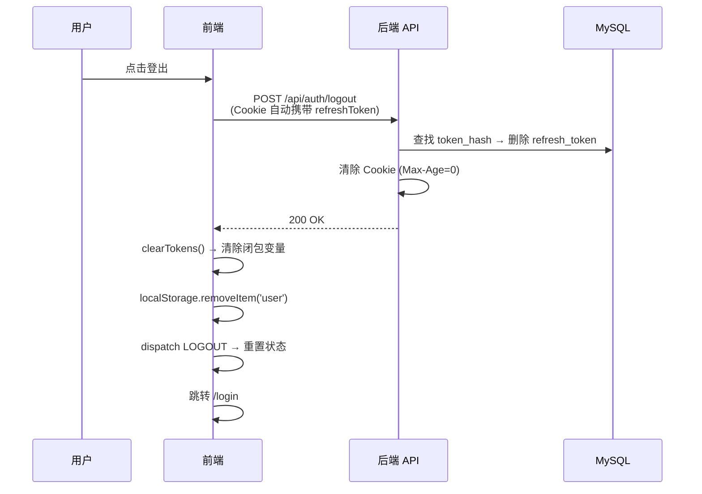
```mermaid
sequenceDiagram
    participant U as 用户
    participant FE as 前端
    participant API as 后端 API
    participant DB as MySQL

    U->>FE: 点击登出
    FE->>API: POST /api/auth/logout<br/>(Cookie 自动携带 refreshToken)
    API->>DB: 查找 token_hash → 删除 refresh_token
    API->>API: 清除 Cookie (Max-Age=0)
    API-->>FE: 200 OK
    FE->>FE: clearTokens() → 清除闭包变量
    FE->>FE: localStorage.removeItem('user')
    FE->>FE: dispatch LOGOUT → 重置状态
    FE->>FE: 跳转 /login
```

> **注意**：登出不使 Access Token 立即失效。JWT 是无状态的，签出去了就无法撤回。登出后 15 分钟内旧 Token 理论上还能用，但 Refresh Token 已删除，无法续期。如果需要更强的即时失效，需要引入 Token 黑名单（当前方案未实现）。

### 5.11 页面刷新恢复（Rehydration）

闭包变量在页面刷新后丢失，需要通过 Refresh Token 恢复认证状态：

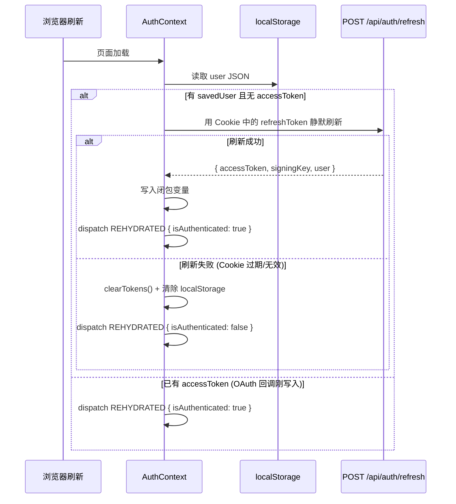
```mermaid
sequenceDiagram
    participant Browser as 浏览器刷新
    participant Context as AuthContext
    participant LS as localStorage
    participant API as POST /api/auth/refresh

    Browser->>Context: 页面加载
    Context->>LS: 读取 user JSON
    alt 有 savedUser 且无 accessToken
        Context->>API: 用 Cookie 中的 refreshToken 静默刷新
        alt 刷新成功
            API-->>Context: { accessToken, signingKey, user }
            Context->>Context: 写入闭包变量
            Context->>Context: dispatch REHYDRATED { isAuthenticated: true }
        else 刷新失败 (Cookie 过期/无效)
            Context->>Context: clearTokens() + 清除 localStorage
            Context->>Context: dispatch REHYDRATED { isAuthenticated: false }
        end
    else 已有 accessToken (OAuth 回调刚写入)
        Context->>Context: dispatch REHYDRATED { isAuthenticated: true }
    end
```

### 5.12 安全防线总结

| 攻击向量 | 防御手段 |
|---|---|
| **XSS 窃取 Token** | Access Token 存闭包变量（非 localStorage），Refresh Token 是 httpOnly Cookie |
| **CSRF 利用 Cookie** | Refresh Token 的 `Path=/api/auth`，只在刷新时自动携带；`SameSite=Lax` 限制跨站 |
| **中间人窃取** | 生产环境 Cookie 加 `Secure` + `SameSite=None`，仅 HTTPS 传输 |
| **重放攻击** | Nonce + 时间戳 + Redis SETNX，每个请求只能用一次 |
| **请求篡改** | HMAC-SHA256 签名覆盖 timestamp + nonce + body |
| **Token 泄露长期有效** | Access Token 15 分钟过期；Refresh Token 轮换，用一次就换 |
| **密码暴力破解** | 连续 5 次失败锁定 15 分钟 |
| **管理员禁用用户** | Redis 存禁用标记，JwtAuthFilter 每次请求检查，立即生效不依赖 Token 过期 |

---

## 6. OAuth 登录流程

系统支持 GitHub 和 Google 两种 OAuth 登录，流程一致：

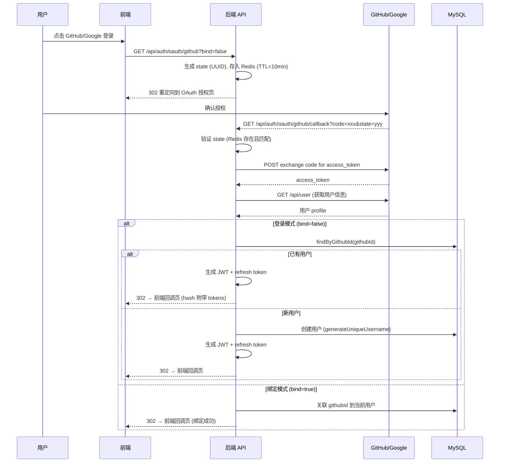
```mermaid
sequenceDiagram
    participant U as 用户
    participant FE as 前端
    participant API as 后端 API
    participant OAuth as GitHub/Google
    participant DB as MySQL

    U->>FE: 点击 GitHub/Google 登录
    FE->>API: GET /api/auth/oauth/github?bind=false
    API->>API: 生成 state (UUID), 存入 Redis (TTL=10min)
    API-->>FE: 302 重定向到 OAuth 授权页

    U->>OAuth: 确认授权
    OAuth-->>API: GET /api/auth/oauth/github/callback?code=xxx&state=yyy

    API->>API: 验证 state (Redis 存在且匹配)
    API->>OAuth: POST exchange code for access_token
    OAuth-->>API: access_token
    API->>OAuth: GET /api/user (获取用户信息)
    OAuth-->>API: 用户 profile

    alt 登录模式 (bind=false)
        API->>DB: findByGithubId(githubId)
        alt 已有用户
            API->>API: 生成 JWT + refresh token
            API-->>FE: 302 → 前端回调页 (hash 附带 tokens)
        else 新用户
            API->>DB: 创建用户 (generateUniqueUsername)
            API->>API: 生成 JWT + refresh token
            API-->>FE: 302 → 前端回调页
        end
    else 绑定模式 (bind=true)
        API->>DB: 关联 githubId 到当前用户
        API-->>FE: 302 → 前端回调页 (绑定成功)
    end
```

### OAuth State 管理

- 登录模式：`state = UUID`，存入 Redis `miao:oauth:state:{state}` → `login`，TTL 10 分钟
- 绑定模式：`state = UUID`，存入 Redis `miao:oauth:state:{state}` → `bind:{userId}`，TTL 10 分钟
- 回调时验证 state 存在且匹配，用后删除（一次性使用）

---

## 7. 限流与防重放

### 7.1 滑动窗口限流

基于 Redis Sorted Set + Lua 脚本实现分布式滑动窗口限流：

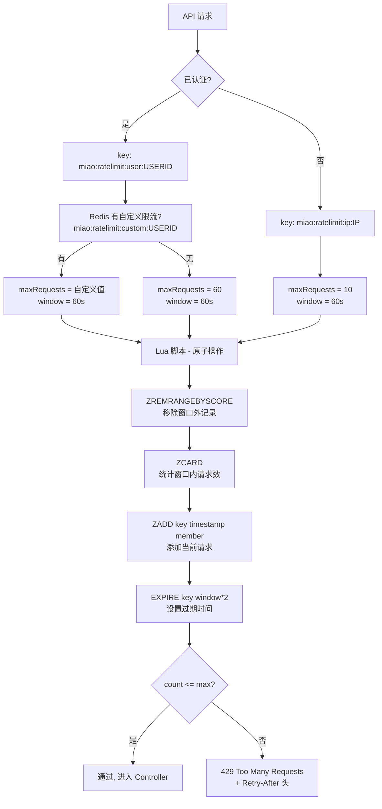
```mermaid
graph TD
    Request[API 请求] --> Check{已认证?}
    Check -->|是| UserKey["key: miao:ratelimit:user:USERID"]
    Check -->|否| IPKey["key: miao:ratelimit:ip:IP"]

    UserKey --> CustomCheck["Redis 有自定义限流?<br/>miao:ratelimit:custom:USERID"]
    CustomCheck -->|有| CustomLimit["maxRequests = 自定义值<br/>window = 60s"]
    CustomCheck -->|无| DefaultAuth["maxRequests = 60<br/>window = 60s"]

    IPKey --> DefaultPublic["maxRequests = 10<br/>window = 60s"]

    CustomLimit --> Lua["Lua 脚本 - 原子操作"]
    DefaultAuth --> Lua
    DefaultPublic --> Lua

    Lua --> Remove["ZREMRANGEBYSCORE<br/>移除窗口外记录"]
    Remove --> Count["ZCARD<br/>统计窗口内请求数"]
    Count --> Add["ZADD key timestamp member<br/>添加当前请求"]
    Add --> TTL["EXPIRE key window*2<br/>设置过期时间"]
    TTL --> Result{count <= max?}
    Result -->|是| Pass[通过, 进入 Controller]
    Result -->|否| Reject[429 Too Many Requests<br/>+ Retry-After 头]
```

### 7.2 防重放机制

| 检查项 | 实现 | 配置 |
|---|---|---|
| 时间戳容差 | `|请求时间 - 服务端时间| < 5min` | `miao.anti-replay.timestamp-tolerance-minutes` |
| Nonce 唯一性 | Redis `SETNX(miao:nonce:{nonce}, "1", TTL=300s)` | `miao.anti-replay.nonce-ttl-seconds` |
| HMAC 签名 | `HMAC-SHA256(signingKey, timestamp+nonce+body)` | 签名密钥随登录生成，存储在 User.signingKey |
| 密钥过渡 | 登出/改密后旧密钥缓存 30 秒 | `miao.auth.signing-key-transition-seconds` |

---

## 8. 管理后台

### 8.1 管理后台功能模块

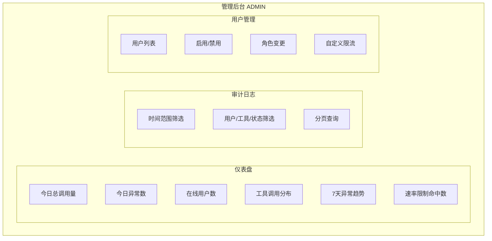
```mermaid
graph TB
    subgraph AdminModule["管理后台 ADMIN"]
        subgraph DashboardGrp["仪表盘"]
            DS1[今日总调用量]
            DS2[今日异常数]
            DS3[在线用户数]
            DS4[工具调用分布]
            DS5[7天异常趋势]
            DS6[速率限制命中数]
        end
        subgraph LogsGrp["审计日志"]
            L1[时间范围筛选]
            L2[用户/工具/状态筛选]
            L3[分页查询]
        end
        subgraph UsersGrp["用户管理"]
            U1[用户列表]
            U2[启用/禁用]
            U3[角色变更]
            U4[自定义限流]
        end
    end
```

### 8.2 用户管理操作时序

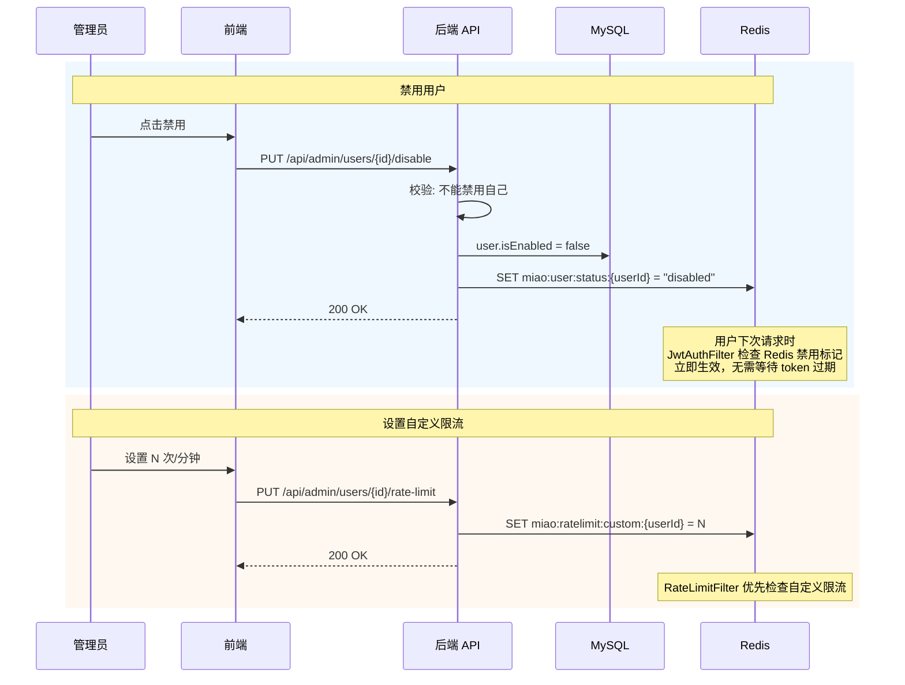
```mermaid
sequenceDiagram
    participant Admin as 管理员
    participant FE as 前端
    participant API as 后端 API
    participant DB as MySQL
    participant Redis as Redis

    rect rgb(240, 248, 255)
        Note over Admin,Redis: 禁用用户
        Admin->>FE: 点击禁用
        FE->>API: PUT /api/admin/users/{id}/disable
        API->>API: 校验: 不能禁用自己
        API->>DB: user.isEnabled = false
        API->>Redis: SET miao:user:status:{userId} = "disabled"
        API-->>FE: 200 OK
        Note over Redis: 用户下次请求时<br/>JwtAuthFilter 检查 Redis 禁用标记<br/>立即生效，无需等待 token 过期
    end

    rect rgb(255, 248, 240)
        Note over Admin,Redis: 设置自定义限流
        Admin->>FE: 设置 N 次/分钟
        FE->>API: PUT /api/admin/users/{id}/rate-limit
        API->>Redis: SET miao:ratelimit:custom:{userId} = N
        API-->>FE: 200 OK
        Note over Redis: RateLimitFilter 优先检查自定义限流
    end
```

---

## 9. 前端架构

### 9.1 前端模块结构

```mermaid
graph TB
    subgraph RouteLayer["路由层"]
        Public[公开路由]
        Protected[受保护路由<br/>RequireAuth]
    end

    subgraph PublicPages["公开页面"]
        Login[/login 登录]
        Register[/register 注册]
        OAuthCB[/oauth/callback 回调]
    end

    subgraph ProtectedPages["受保护页面"]
        Tools[/tools 工具列表]
        Settings[/settings 个人设置]
        ChangePwd[/change-password 强制改密]
    end

    subgraph AdminPages["管理页面 - 需 ADMIN 角色"]
        AdminDash[/admin/dashboard 仪表盘]
        AdminLogs[/admin/logs 审计日志]
        AdminUsers[/admin/users 用户管理]
    end

    Public --> Login
    Public --> Register
    Public --> OAuthCB
    Protected --> Tools
    Protected --> Settings
    Protected --> ChangePwd
    Protected --> AdminDash
    Protected --> AdminLogs
    Protected --> AdminUsers
```

### 9.2 前端状态管理

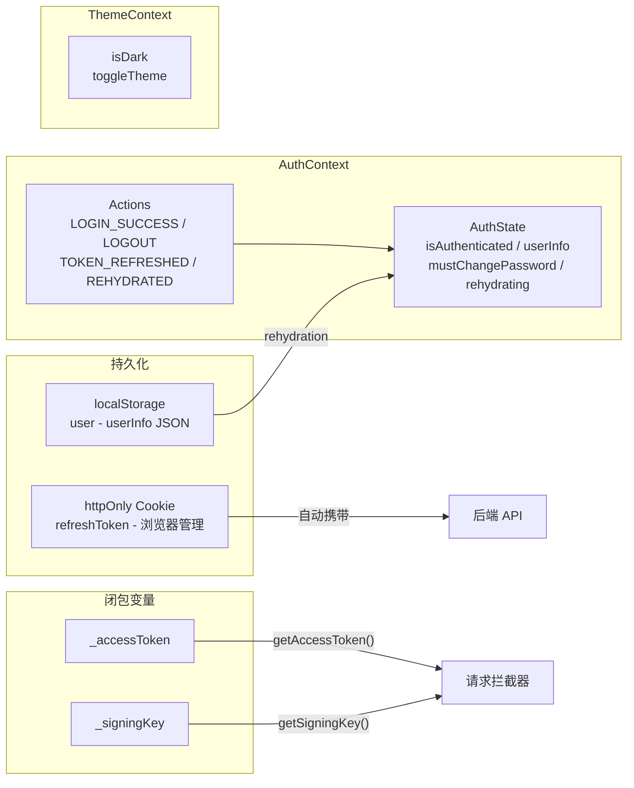
```mermaid
graph LR
    subgraph AuthContext["AuthContext"]
        State[AuthState<br/>isAuthenticated / userInfo<br/>mustChangePassword / rehydrating]
        Actions[Actions<br/>LOGIN_SUCCESS / LOGOUT<br/>TOKEN_REFRESHED / REHYDRATED]
    end

    subgraph ClosureVars["闭包变量"]
        AT[_accessToken]
        SK[_signingKey]
    end

    subgraph Persistence["持久化"]
        LS[localStorage<br/>user - userInfo JSON]
        Cookie[httpOnly Cookie<br/>refreshToken - 浏览器管理]
    end

    subgraph ThemeContext["ThemeContext"]
        Theme[isDark<br/>toggleTheme]
    end

    Interceptor[请求拦截器]
    BackendAPI[后端 API]

    Actions --> State
    AT -->|"getAccessToken()"| Interceptor
    SK -->|"getSigningKey()"| Interceptor
    LS -->|"rehydration"| State
    Cookie -->|"自动携带"| BackendAPI
```

### 9.3 Axios 拦截器

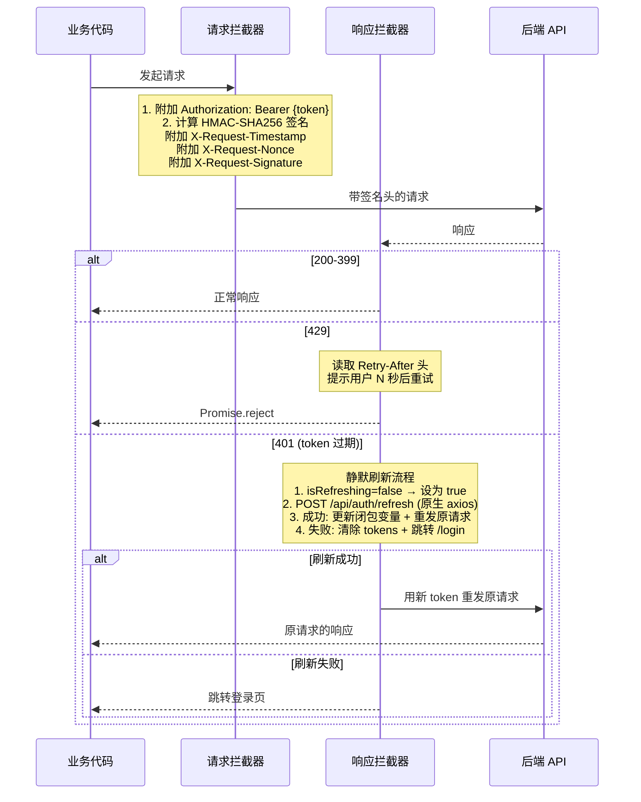
```mermaid
sequenceDiagram
    participant App as 业务代码
    participant Req as 请求拦截器
    participant Res as 响应拦截器
    participant API as 后端 API

    App->>Req: 发起请求
    Note over Req: 1. 附加 Authorization: Bearer {token}<br/>2. 计算 HMAC-SHA256 签名<br/>   附加 X-Request-Timestamp<br/>   附加 X-Request-Nonce<br/>   附加 X-Request-Signature
    Req->>API: 带签名头的请求

    API-->>Res: 响应

    alt 200-399
        Res-->>App: 正常响应
    else 429
        Note over Res: 读取 Retry-After 头<br/>提示用户 N 秒后重试
        Res-->>App: Promise.reject
    else 401 (token 过期)
        Note over Res: 静默刷新流程<br/>1. isRefreshing=false → 设为 true<br/>2. POST /api/auth/refresh (原生 axios)<br/>3. 成功: 更新闭包变量 + 重发原请求<br/>4. 失败: 清除 tokens + 跳转 /login
        alt 刷新成功
            Res->>API: 用新 token 重发原请求
            API-->>App: 原请求的响应
        else 刷新失败
            Res-->>App: 跳转登录页
        end
    end
```

---

## 10. 数据模型

### ER 图

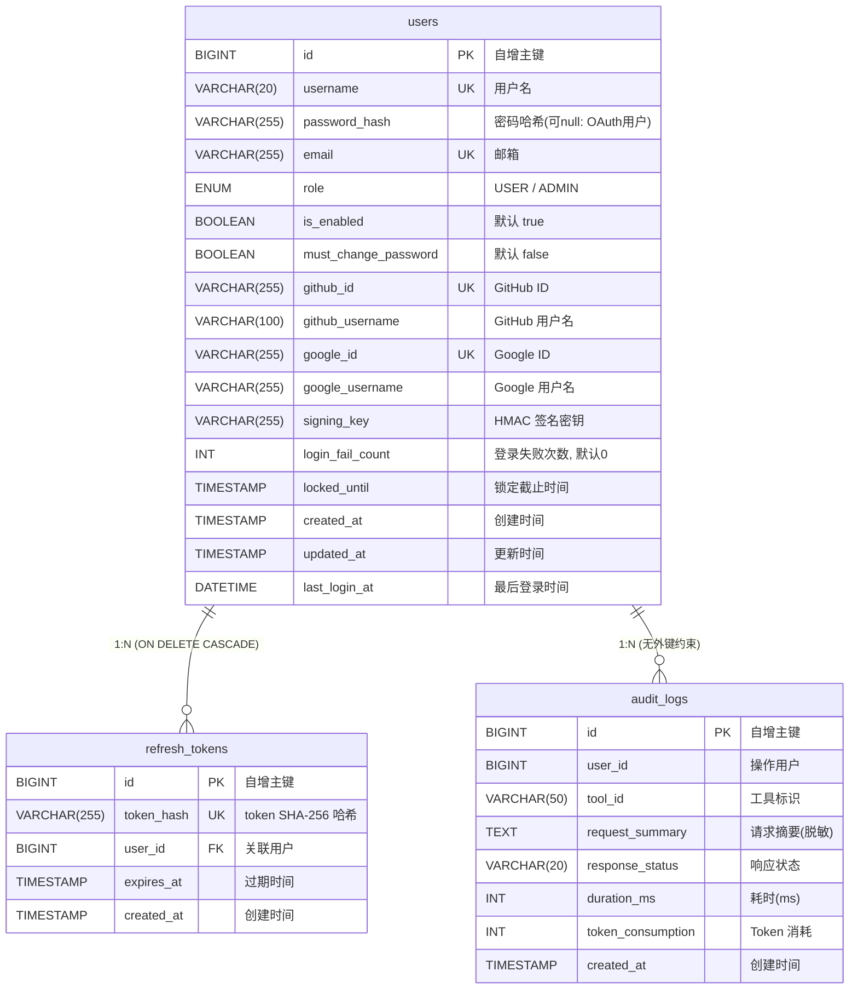
```mermaid
erDiagram
    users {
        BIGINT id PK "自增主键"
        VARCHAR(20) username UK "用户名"
        VARCHAR(255) password_hash "密码哈希(可null: OAuth用户)"
        VARCHAR(255) email UK "邮箱"
        ENUM role "USER / ADMIN"
        BOOLEAN is_enabled "默认 true"
        BOOLEAN must_change_password "默认 false"
        VARCHAR(255) github_id UK "GitHub ID"
        VARCHAR(100) github_username "GitHub 用户名"
        VARCHAR(255) google_id UK "Google ID"
        VARCHAR(255) google_username "Google 用户名"
        VARCHAR(255) signing_key "HMAC 签名密钥"
        INT login_fail_count "登录失败次数, 默认0"
        TIMESTAMP locked_until "锁定截止时间"
        TIMESTAMP created_at "创建时间"
        TIMESTAMP updated_at "更新时间"
        DATETIME last_login_at "最后登录时间"
    }

    refresh_tokens {
        BIGINT id PK "自增主键"
        VARCHAR(255) token_hash UK "token SHA-256 哈希"
        BIGINT user_id FK "关联用户"
        TIMESTAMP expires_at "过期时间"
        TIMESTAMP created_at "创建时间"
    }

    audit_logs {
        BIGINT id PK "自增主键"
        BIGINT user_id "操作用户"
        VARCHAR(50) tool_id "工具标识"
        TEXT request_summary "请求摘要(脱敏)"
        VARCHAR(20) response_status "响应状态"
        INT duration_ms "耗时(ms)"
        INT token_consumption "Token 消耗"
        TIMESTAMP created_at "创建时间"
    }

    users ||--o{ refresh_tokens : "1:N (ON DELETE CASCADE)"
    users ||--o{ audit_logs : "1:N (无外键约束)"
```

### 表说明

| 表 | 迁移脚本 | 说明 |
|---|---|---|
| `users` | V1 + V5 + V6 + V7 + V9 | 用户主表，支持密码/OAuth 登录 |
| `refresh_tokens` | V4 | 刷新令牌，单用户上限 5 个，轮换机制 |
| `audit_logs` | V8 | AI 工具调用审计日志，管理员可查询 |

---

## 11. Redis 键设计

| 键模式 | 类型 | TTL | 用途 |
|---|---|---|---|
| `miao:nonce:{nonce}` | STRING | 300s | 防重放 Nonce 去重 |
| `miao:ratelimit:user:{userId}` | SORTED SET | window×2 | 已认证用户滑动窗口限流 |
| `miao:ratelimit:ip:{IP}` | SORTED SET | window×2 | 未认证用户 IP 限流 |
| `miao:ratelimit:custom:{userId}` | STRING | 持久 | 管理员设置的用户自定义限流值 |
| `miao:user:status:{userId}` | STRING | 持久 | 用户禁用标记（"disabled"） |
| `miao:session:{userId}:{sessionId}` | STRING | - | 会话管理（预留） |
| `miao:signing:transition:{userId}` | STRING | 30s | 签名密钥过渡期旧密钥缓存 |
| `miao:oauth:state:{state}` | STRING | 10min | OAuth state 防 CSRF |

---

## 12. 配置管理

### 配置文件分层

| 文件 | 用途 | 密钥处理 | 提交 |
|---|---|---|---|
| `application.yml` | 共享基础配置 | 不含密钥 | ✅ |
| `application-dev.yml` | 开发环境 | `${ENV_VAR:dev-占位符}` | ✅ |
| `application-prod.yml` | 生产环境 | `${ENV_VAR}` 无默认值 | ✅ |
| `application-local.yml` | 本地真实密钥 | 明文 | ❌ |

### Profile 激活

- 本地开发：`spring.profiles.active: dev,local`（默认，local 覆盖 dev）
- 生产环境：`SPRING_PROFILES_ACTIVE=prod`（环境变量指定）

### 核心 Spring 配置项

| 配置键 | 默认值 | 说明 |
|---|---|---|
| `miao.jwt.access-token-expiry-minutes` | 15 | Access Token 有效期 |
| `miao.jwt.refresh-token-expiry-days` | 7 | Refresh Token 有效期 |
| `miao.security.cookie-secure` | false (dev) / true (prod) | Cookie Secure 标志 |
| `miao.rate-limit.authenticated.max-requests` | 60 | 已认证用户每分钟请求上限 |
| `miao.rate-limit.authenticated.window-seconds` | 60 | 已认证用户限流窗口 |
| `miao.rate-limit.public.max-requests` | 10 | 未认证用户每分钟请求上限 |
| `miao.rate-limit.public.window-seconds` | 60 | 未认证用户限流窗口 |
| `miao.anti-replay.timestamp-tolerance-minutes` | 5 | 时间戳容差 |
| `miao.anti-replay.nonce-ttl-seconds` | 300 | Nonce 缓存 TTL |
| `miao.cors.allowed-origins` | `http://localhost:5173` | CORS 允许来源 |

---

## 13. 错误处理

### 统一响应格式

```json
{
  "code": "ERROR_CODE",
  "message": "中文描述",
  "data": null,
  "requestId": "uuid"
}
```

### 错误码体系

| 错误码 | HTTP 状态 | 说明 |
|---|---|---|
| `AUTH_LOGIN_FAILED` | 401 | 用户名或密码错误 |
| `AUTH_TOKEN_EXPIRED` | 401 | Token 已过期 |
| `AUTH_TOKEN_INVALID` | 401 | Token 无效 |
| `AUTH_UNAUTHORIZED` | 401/403 | 未授权或权限不足 |
| `USER_DISABLED` | 401 | 用户已被禁用 |
| `USER_LOCKED` | 403 | 用户被临时锁定（连续登录失败） |
| `USER_NOT_FOUND` | 404 | 用户不存在 |
| `USER_ALREADY_EXISTS` | 409 | 用户名已存在 |
| `RATE_LIMIT_EXCEEDED` | 429 | 请求超限 |
| `VALIDATION_FAILED` | 400 | 参数校验失败 |
| `SYSTEM_ERROR` | 500 | 服务器内部错误 |

### 全局异常处理流程

```mermaid
graph TD
    Ex[异常抛出] --> Type{异常类型}
    Type -->|BusinessException| BE["对应 HTTP 状态码<br/>+ errorCode + message + requestId"]
    Type -->|MethodArgumentNotValidException| VE["400 VALIDATION_FAILED<br/>字段错误拼接"]
    Type -->|AccessDeniedException| AE["403 AUTH_UNAUTHORIZED<br/>权限不足"]
    Type -->|其他 Exception| UE["500 SYSTEM_ERROR<br/>服务器内部错误"]

    BE & VE & AE & UE --> Response[统一 ApiResponse JSON 响应]
```
